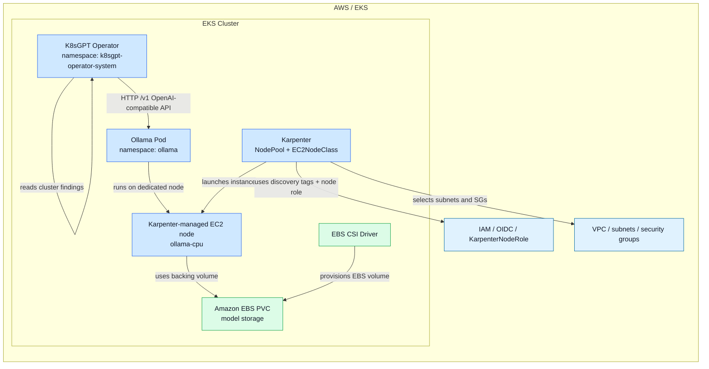

# k8sgpt-ollama-localai-eks

AI-powered Kubernetes issue detection on EKS using K8sGPT + a local Ollama LLM, with the inference node provisioned on demand by Karpenter.

This repo deploys a lightweight, CPU-only Ollama workload to a dedicated EKS node pool and connects K8sGPT to it through the OpenAI-compatible `/v1` endpoint. The operator then analyzes cluster resources and asks the local model for explanations and remediation guidance.

## Architecture

The deployment is intentionally split into two concerns:

- Platform infrastructure: EKS, Karpenter, and the EBS CSI driver
- Workload layer: Ollama and the K8sGPT operator

High-level AWS/EKS flow:



This layout makes the AWS/EKS dependencies explicit: Karpenter provisions the EC2 node, the EBS CSI driver provisions storage, and the K8sGPT operator sends analysis requests to the local Ollama service running on that dedicated node.

## Components

### 1. Ollama

- Namespace: `ollama`
- Helm release: `ollama`
- Model: `llama3.2:3b`
- CPU-only deployment
- PVC-backed model storage
- Affinity by node selector and taint/toleration to land on a dedicated Karpenter-provisioned node

The values are defined in `environments/ajay-workspace/ollama-values.yaml`.

### 2. Karpenter node for Ollama

- NodePool: `ollama-cpu`
- EC2NodeClass: `ollama-cpu`
- Uses a dedicated CPU node with `m` / `c` family instances, sized `xlarge` or `2xlarge`, on-demand only
- Taint: `workload=ollama:NoSchedule`
- Consolidation: `WhenEmpty` with `consolidateAfter: 10m`

The NodePool and EC2NodeClass are defined in:

- `environments/ajay-workspace/nodepool.yaml`
- `environments/ajay-workspace/ec2nodeclass.yaml`

### 3. K8sGPT operator

- Namespace: `k8sgpt-operator-system`
- CR: `K8sGPT` named `k8sgpt-ollama`
- AI backend: `localai`
- Base URL: `http://ollama.ollama.svc.cluster.local:11434/v1`

The custom resource is in `manifests/k8sgpt-ollama-cr.yaml`.

## Why the `localai` backend is used

The version of the K8sGPT operator in this environment does not accept `backend: ollama` in its CRD. The supported path is to use the `localai` backend and point it at Ollama's OpenAI-compatible API endpoint at `/v1`.

This is the key configuration:

```yaml
spec:
  ai:
    enabled: true
    model: llama3.2:3b
    backend: localai
    baseUrl: http://ollama.ollama.svc.cluster.local:11434/v1
```

## Required cluster prerequisites

Before running the install script, the target EKS cluster must already have:

- An operational EKS cluster
- Karpenter installed and configured
- A valid `KarpenterNodeRole-<cluster>` role
- Subnet and security group tags matching `karpenter.sh/discovery: <cluster-name>`
- EBS CSI driver installed for PVC provisioning
- A default or explicit `gp2` storage class, because the chart is configured to use `gp2`

The install script assumes:

- Cluster name: `ajay-workspace`
- Region: `us-east-2`
- Account: `573631993187`

If your values differ, update the constants in `scripts/install.sh` and the Karpenter metadata in `environments/ajay-workspace/*.yaml` before applying.

## Repository layout

```text
.
├── README.md
├── docs/
│   └── TROUBLESHOOTING.md
├── environments/
│   └── ajay-workspace/
│       ├── ec2nodeclass.yaml
│       ├── nodepool.yaml
│       └── ollama-values.yaml
├── manifests/
│   └── k8sgpt-ollama-cr.yaml
├── scripts/
│   ├── cleanup.sh
│   └── install.sh
└── .idea/
```

## Install

Run the project-provided bootstrap script:

```bash
./scripts/install.sh ajay-workspace
```

What it does:

1. Ensures the AWS EBS CSI driver is installed
2. Applies the Karpenter `EC2NodeClass` and `NodePool`
3. Installs Ollama via Helm into the `ollama` namespace
4. Waits for the model pod to become ready
5. Installs the K8sGPT operator
6. Applies the `K8sGPT` custom resource

## Verify

After installation, check the core components:

```bash
kubectl get pods -n ollama
kubectl get pods -n k8sgpt-operator-system
kubectl get results -n k8sgpt-operator-system
kubectl get nodes -o wide
```

Expected state:

- `ollama` pod healthy and running
- K8sGPT operator pod healthy
- `kubectl get results` returning findings after a short delay
- One dedicated compute node for Ollama, not shared with the general cluster workload

## Cleanup

To remove the project and allow Karpenter to reclaim the dedicated node:

```bash
./scripts/cleanup.sh
```

This removes:

- K8sGPT CR and operator
- Ollama release and PVCs
- Ollama Karpenter `NodePool` and `EC2NodeClass`
- The dedicated node after Karpenter reconciles the cluster

## Operational notes

- The model runs on a CPU-only node by design; this is a low-cost development or demo pattern.
- The PVC is backed by EBS through the CSI driver; without EBS CSI, the volume will remain pending indefinitely.
- The shared pain points are infrastructure-level rather than application-level, so `kubectl get storageclass`, `kubectl get pods -n kube-system`, and `kubectl explain ec2nodeclass.spec` are useful first checks.
- See `docs/TROUBLESHOOTING.md` for the exact issues encountered during setup and the fixes that were applied.

## Notes for future environments

When reusing this repo on a different cluster, review these files first:

- `scripts/install.sh` for cluster name, region, and account values
- `environments/ajay-workspace/ec2nodeclass.yaml` for the Karpenter discovery tags and node role
- `environments/ajay-workspace/nodepool.yaml` for taints, requirements, and consolidation policy
- `environments/ajay-workspace/ollama-values.yaml` for storage class and model sizing
- `manifests/k8sgpt-ollama-cr.yaml` for the backend and base URL

These are the fields that are most likely to need environment-specific adjustment.
